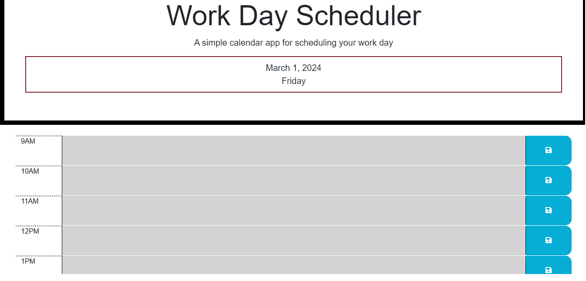

# Work Day Scheduler

This is a program that allows one to make a workday scheduler from 9 AM to 5 PM, it will allow one to save events on the scheduler and save their entries.

## Screenshot

## Deployed Application

https://monsosam.github.io/Workday-Scheduler/
